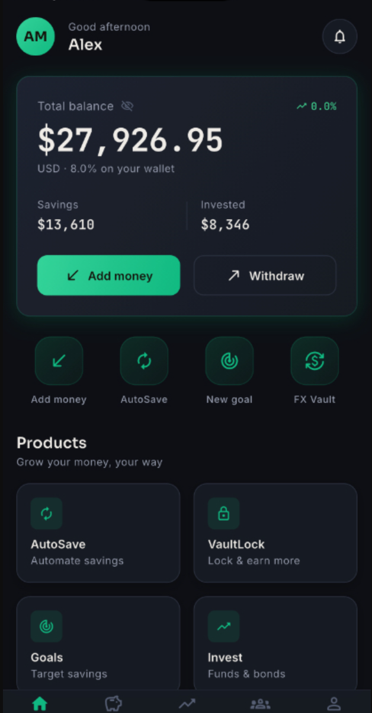
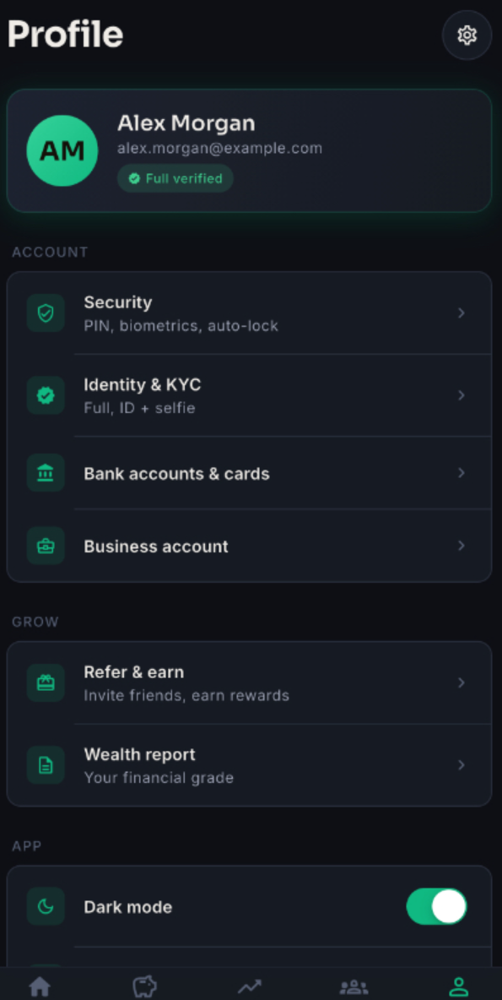
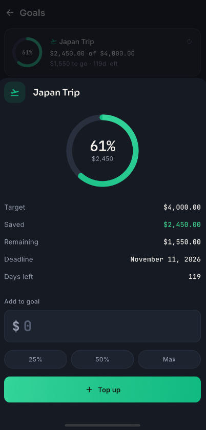
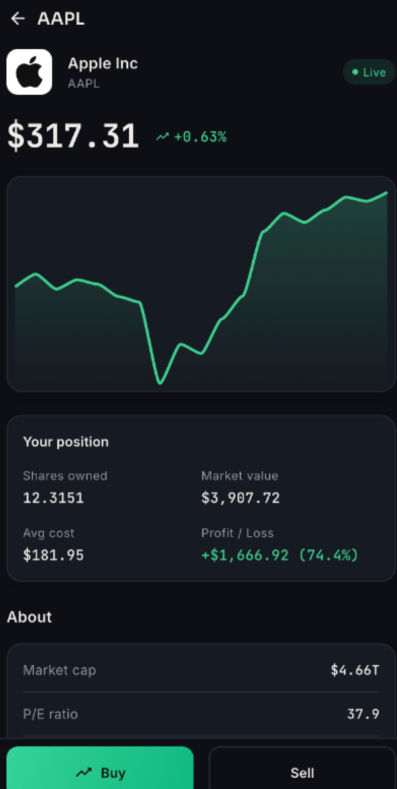
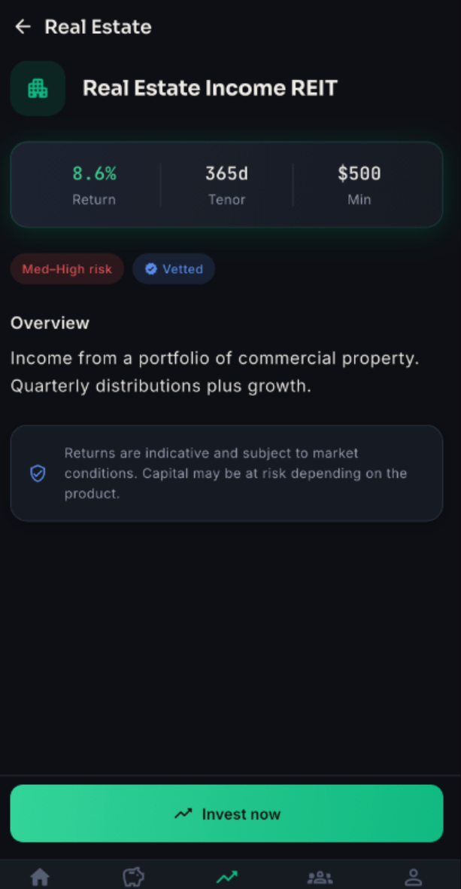
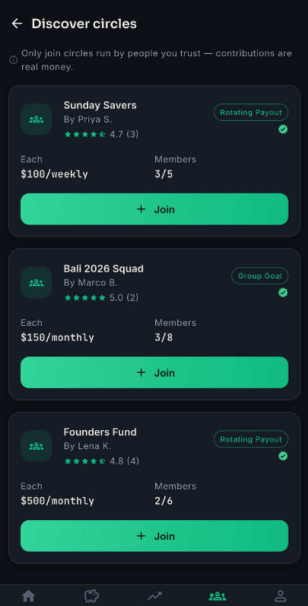
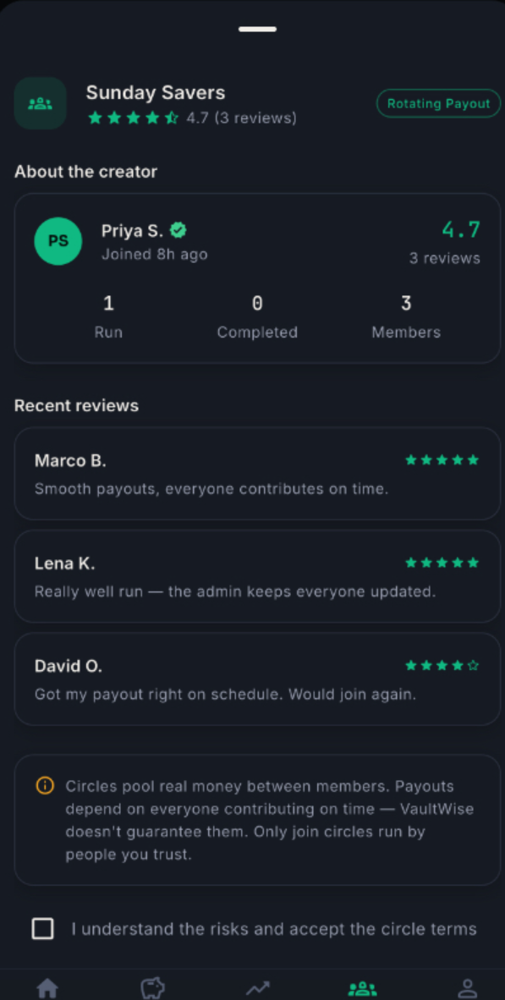

# 💰 WhiteLabel Savings & Investment Platform

### Launch your own digital savings and investment platform.

**Mobile App • Web Dashboard • Admin Panel • Investment Plans**

🚀 Production Ready • White Label • Fully Scalable

📩 **Telegram:** https://t.me/edwardgarciaa

---

  

  

  

  

  

  

# 🚀 Overview

Launch your own modern savings and investment platform where users can save money, join investment plans, earn rewards, and manage their financial goals from one application.

This complete white-label solution includes a Flutter mobile app, web dashboard, and Laravel admin panel, allowing you to launch your own branded fintech platform quickly.

Everything can be customized with your own logo, colors, domain, and branding.

---

# 💰 Savings Features

Help users build healthy saving habits.

Features include:

- Personal Savings Wallet
- Goal-Based Savings
- Fixed Savings Plans
- Flexible Savings
- Automatic Progress Tracking
- Saving History
- Savings Statistics
- Wallet Balance

---

# 📈 Investment Plans

Create unlimited investment opportunities.

Features:

- Fixed Investment Plans
- Flexible Investment Plans
- Daily Returns
- Weekly Returns
- Monthly Returns
- Investment History
- Profit Tracking
- Automatic Maturity

---

# 🎯 Financial Goals

Users can create personal saving goals.

Examples:

- Vacation Fund
- New Car
- House Deposit
- Education
- Wedding
- Emergency Fund

Track progress with beautiful visual indicators.

---

# 👛 Digital Wallet

Built-in wallet system.

Features:

- Deposit Funds
- Withdraw Funds
- Wallet Transfers
- Bonus Balance
- Transaction History
- Balance Overview

---

# 💳 Deposit & Withdraw

Flexible payment management.

Supports:

- Online Payments
- Manual Deposits
- Bank Transfers
- Multiple Payment Gateways
- Withdrawal Requests
- Admin Approval

---

# 📊 Dashboard

Users can monitor:

- Total Savings
- Total Investments
- Current Profit
- Wallet Balance
- Recent Transactions
- Active Plans
- Completed Plans

---

# 🎁 Referral Program

Grow your platform organically.

Includes:

- Referral Links
- Referral Earnings
- Commission Tracking
- Referral Dashboard
- Invite Statistics

---

# 🏆 Rewards & Bonuses

Reward active users.

Supports:

- Signup Bonuses
- Referral Bonuses
- Investment Bonuses
- Promotional Rewards
- Cashback Campaigns

---

# 🔔 Notifications

Keep users informed.

Supports:

- Push Notifications
- Email Notifications
- Investment Updates
- Deposit Alerts
- Withdrawal Alerts
- Reward Notifications

---

# 🛡️ Security

Enterprise-grade security.

Features:

- KYC Verification
- Two-Factor Authentication (2FA)
- Email Verification
- Secure Login
- Session Management
- Password Recovery

---

# 👤 User Features

- Dashboard
- Wallet
- Savings Plans
- Investment Plans
- Financial Goals
- Deposit Funds
- Withdraw Funds
- Referral Center
- Notifications
- Transaction History
- Account Settings
- Security Settings

---

# 💻 Admin Panel

## Dashboard

- Total Users
- Total Deposits
- Total Withdrawals
- Total Investments
- Total Savings
- Revenue Overview
- Interactive Charts

---

## User Management

- User Accounts
- Wallet Management
- Balance Adjustment
- KYC Approval
- Suspend Users
- Transaction History

---

## Savings Management

Manage:

- Savings Plans
- Saving Categories
- Interest Rates
- Saving Rules
- Goal Templates

---

## Investment Management

Create and manage:

- Investment Plans
- Profit Rates
- Investment Terms
- Maturity Periods
- Minimum & Maximum Investments

---

## Financial Management

- Deposits
- Withdrawals
- Manual Approvals
- Transaction Logs
- Wallet Reports

---

## Referral Management

Configure:

- Referral Commissions
- Reward Levels
- Bonus Campaigns
- Referral Reports

---

## Notifications

- Push Notifications
- Email Broadcasts
- Promotional Campaigns
- System Announcements

---

## Content Management

Manage:

- Homepage
- About
- FAQ
- Blog
- Terms & Conditions
- Privacy Policy

---

## Site Settings

Configure:

- Logo
- Branding
- SMTP
- Payment Gateways
- Currency
- Localization
- General Settings

---

# 🌍 Multi Language

Supports multiple languages with RTL compatibility.

---

# 💱 Multi Currency

Supports multiple fiat currencies for international users.

---

# 📱 Mobile Experience

- Android
- iOS
- Responsive UI
- Modern Design
- Fast Performance

---

# 🎨 White Label

Everything can be customized.

- Logo
- Brand Name
- Colors
- Domain
- Splash Screen
- Email Templates
- Homepage
- Theme

No vendor branding.

---

# 🛠 Tech Stack

Backend

- Laravel

Frontend

- Flutter

Database

- MySQL

Admin

- Laravel Admin Panel

---

# 📦 Includes

✅ Flutter Mobile App

✅ Web Dashboard

✅ Admin Panel

✅ REST API

✅ Source Code

✅ Documentation

✅ White Label License

---

# ⭐ Why Choose This Platform?

- Production Ready
- White Label
- Savings Management
- Investment Plans
- Goal Tracking
- Wallet System
- Referral Program
- KYC Verification
- Multi Currency
- Modern UI
- High Performance
- Fully Scalable

---

# 📞 Purchase

Interested in purchasing this platform?

## Telegram

👉 **@edwardgarciaa**

or

**https://t.me/edwardgarciaa**

---

Made with ❤️
